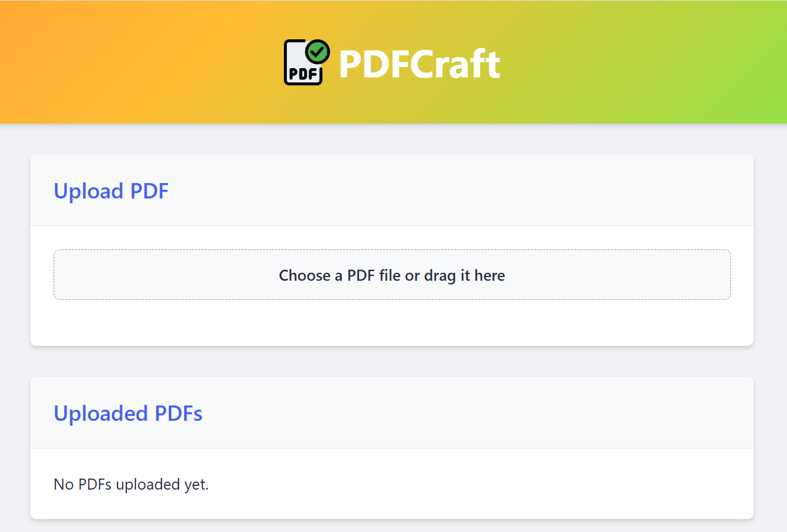

# 📄✨ PDFCraft  

A **feature-rich** PDF editor built using **Flask** that allows you to:  
✅ Convert PDFs to DOCX  
✅ Merge multiple PDFs  
✅ Remove specific pages from PDFs  
✅ Modify PDF permissions with an interactive toolbox  
✅ Add password protection to PDFs  

---

## 🚀 Features  

🔹 **Convert PDF to DOCX** – Easily convert your PDFs into editable Word documents.  
🔹 **Merge PDFs** – Combine multiple PDFs in your desired order.  
🔹 **Remove Pages** – Select and delete specific pages from a PDF.  
🔹 **Manage Permissions** – Choose what actions users can perform on your PDFs.  
🔹 **Password Protection** – Secure your PDFs with a custom password.  

---

## 🛠️ Tech Stack  

🔹 **Backend**: Python, Flask  
🔹 **PDF Processing**: PyPDF2, pdf2docx  
🔹 **Frontend**: HTML, CSS (Bootstrap)  
🔹 **Deployment**: Render, AWS  

---

## 📂 Project Structure  

```
pdf_editor_app/
│── static/               # CSS, JS, images
│── templates/            # HTML files
│   ├── index.html
│── uploads/              # Stores uploaded PDFs
│── app.py                # Main Flask application
│── config.py             # Configuration settings
│── requirements.txt      # Python dependencies
│── utils.py              # Utility functions
│── pdf_operations.py     # PDF manipulation functions
│── README.md             # Project documentation
```

---

## 🚀 Installation Guide  

### **1️⃣ Clone the Repository**  
```sh
git clone https://github.com/Vedant363/pdfcraft.git
cd pdfcraft
```

### **2️⃣ Set Up a Virtual Environment**  
```sh
python -m venv venv
source venv/bin/activate  # On Windows use: venv\Scripts\activate
```

### **3️⃣ Install Dependencies**  
```sh
pip install -r requirements.txt
```

### **4️⃣ Run the Flask App**  
```sh
python app.py
```

📌 The app will be available at **`http://127.0.0.1:5000/`**  

---

## 🎨 UI Preview  



---

## 📜 License  

This project is licensed under the **MIT License**. Feel free to use and modify!  

---

## 💡 Future Enhancements  

🔹 Add **image to PDF conversion**  
🔹 Implement **OCR for scanned PDFs**   

---

### 🚀 **Happy Editing!** 😃  
